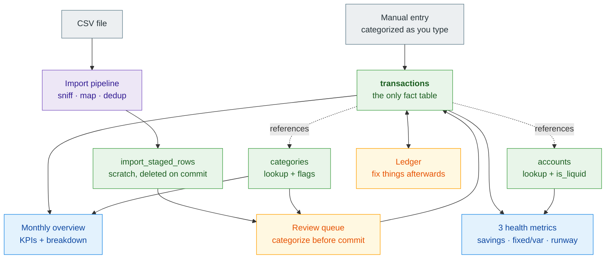
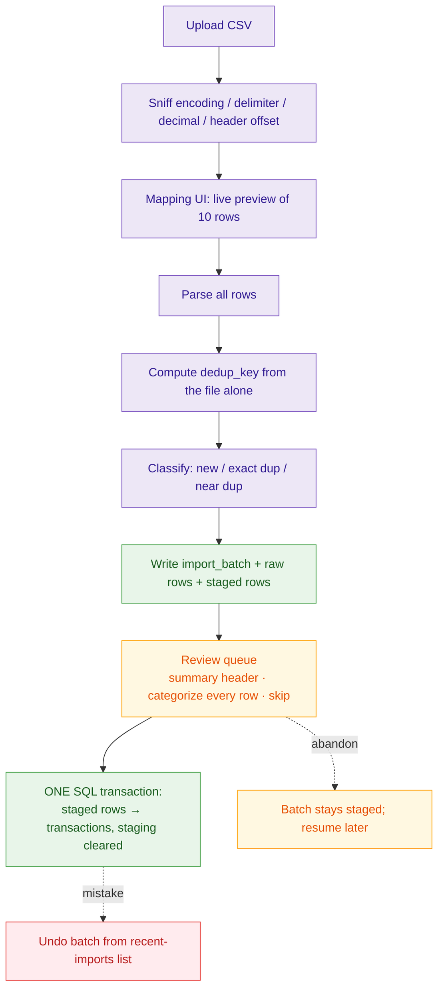

# Financial Copilot — Architecture

**Scope:** the eight-feature MVP in `FEATURES.md` · **Extended design:** `extendedProject/ARCHITECTURE.md`

---

## 1. The system at a glance

One Next.js app on `localhost`, one SQLite file, eight tables. No cloud, no Docker, no separate API process, no login.



| | |
|---|---|
| ⬜ grey | **Input** — comes from outside the system |
| 🟪 purple | **Process** — transforms data on its way somewhere else |
| 🟩 green | **Table** — persisted state in SQLite |
| 🟧 amber | **Screen, reads and writes** |
| 🟦 blue | **Screen, read-only** |

**Two arrows are not data flow.** `transactions → categories` and `transactions → accounts` are foreign keys: a transaction *points at* a category and an account. Nothing is written into those tables by a transaction. Three consequences, all commonly got backwards:

- **Reports read `transactions`**, joined to `categories`. Not accounts. `accounts` contributes one value to the whole reporting layer: the `is_liquid` balance in the runway metric.
- **Balances are not stored.** No balance column exists. It is `opening_balance_minor + SUM(transactions.amount_minor)`, computed on read.
- **Categorizing does not write to `categories`.** It sets `category_id` on a staged row or a transaction. The `categories` table is written only by the seed script and the Categories screen.

**The two input paths are deliberately asymmetric.** Manual entry writes one row straight to `transactions`, categorized in the same form — there is nothing to review, because you typed it. CSV goes through a staging table and a review queue, because it arrives in bulk from a source you do not control, under a mapping profile that is a guess until you see parsed output. Routing quick-add through a review step would be ceremony with no error to catch.

### 1.1 Where things live

```
~/.financial-copilot/app.db       SQLite, WAL — all eight tables
~/.financial-copilot/files/       uploaded CSVs, kept
~/.financial-copilot/backups/     VACUUM INTO snapshots — must sync off-machine

src/app/        pages + Server Actions        src/parsers/  CSV → canonical rows
src/services/   use-cases, tx boundaries      src/db/       Drizzle schema, repositories
src/domain/     pure TypeScript, zero I/O
```

---

## 2. Rules the code must not break

Five invariants. If any is violated you get wrong numbers or a rewrite.

### 2.1 Layers point downward, enforced by ESLint

| Layer | May import | Must not |
|---|---|---|
| `app/` | `services/`, `domain/` types | Touch `db/` or `parsers/`, contain arithmetic |
| `services/` | `domain/`, `db/`, `parsers/` | Import `app/`, know about React or HTTP |
| `domain/` | nothing | Import anything at all |
| `db/` | `domain/` types | Contain business rules |

`domain/` purity is the point: dedup keys, the savings rate, how a breakdown rolls up are all pure functions, so all are testable in milliseconds with no database. Server Actions are adapters only — validate with zod, resolve `userId`, call a service, `revalidatePath`. A fifth concern belongs in `services/`.

### 2.2 Money is integer minor units; expenses are negative

`Money = { minor: number, currency: string }`. €1,234.56 is `{ minor: 123456 }`. Never a float.

- **Expenses negative, income positive**, enforced in the domain and asserted at every write. The UI shows absolute values with direction separate. Changing this after real data exists means migrating every row.
- `number` is safe — `MAX_SAFE_INTEGER` is ~90 trillion euros. `bigint` rejected: `JSON.stringify` throws on it.
- `add`/`subtract` throw on currency mismatch. All accounts are EUR in v1; the guard stays so adding CHF later is a compile error, not a silent wrong balance.
- Formatting is `Intl.NumberFormat`, presentation layer only, never parsed back.

Write `domain/money.ts` first, before any schema. ~100 lines.

### 2.3 `user_id` on every table, in every query

One user, no login screen (§7), so this looks like dead weight. It makes later promotion to Postgres + RLS a day's work instead of a month's. The filter lives in the repository layer; a repository method with no `userId` argument is a type error.

### 2.4 One exclusion predicate, in one file

Every income/expense aggregate uses the same SQL fragment (§5.1). Writing it twice is how a report ends up silently 15% wrong. A static test asserts no aggregate exists without it.

### 2.5 Booking dates are `TEXT`, `'YYYY-MM-DD'`, no timezone

They sort correctly as strings. Timezone-converting a booking date is a bug: the 1st must not become the 31st.

---

## 3. Data model

`user_id NOT NULL REFERENCES users(id)` on every table. Every reference is a declared FK with explicit `ON DELETE` — `RESTRICT` by default, `CASCADE` only for `import_raw_rows` and `import_staged_rows`. `PRAGMA foreign_keys = ON` protects nothing without declared constraints.

Migration 0001 creates all eight tables, including the import ones, though import is built at step 8. Adding an FK to a populated SQLite table is a full rebuild; creating a table early is free.

### 3.1 Schema

```sql
users
  id, email, created_at                          -- exactly one row, seeded

accounts
  id, user_id, name,
  type            TEXT NOT NULL CHECK (type IN ('checking','savings','credit_card','cash')),
  opening_balance_minor INTEGER NOT NULL,
  opening_date    TEXT NOT NULL,
  is_liquid       INTEGER NOT NULL DEFAULT 0,    -- runway numerator
  created_at, updated_at,
  UNIQUE (user_id, name)

categories
  id, user_id, name,
  parent_id       REFERENCES categories(id) ON DELETE RESTRICT,
  kind            TEXT NOT NULL CHECK (kind IN ('income','expense','transfer')),
  is_fixed        INTEGER NOT NULL DEFAULT 0,    -- fixed-vs-variable metric
  is_essential    INTEGER NOT NULL DEFAULT 0,    -- runway denominator
  exclude_from_reports INTEGER NOT NULL DEFAULT 0,
  UNIQUE (user_id, COALESCE(parent_id, ''), name)          -- note 1
  -- two levels max, enforced in the app layer

transactions
  id, user_id,
  account_id      NOT NULL REFERENCES accounts(id) ON DELETE RESTRICT,
  category_id     REFERENCES categories(id) ON DELETE RESTRICT,  -- NULL = uncategorized
  booking_date    TEXT NOT NULL,
  amount_minor    INTEGER NOT NULL,              -- signed, EUR
  counterparty_raw TEXT,                         -- as the bank wrote it
  counterparty    TEXT,                          -- displayed
  description     TEXT,
  end_to_end_ref  TEXT,                          -- bank reference, when mapped (§4.3)
  is_excluded     INTEGER,                       -- NULL inherits category; 0/1 overrides
  import_batch_id REFERENCES import_batches(id) ON DELETE SET NULL,
  raw_row_id      REFERENCES import_raw_rows(id) ON DELETE SET NULL,
  dedup_key       TEXT NOT NULL,
  created_at, updated_at,
  edited_at       TEXT,                          -- NULL until a user edit (§4.5)

  UNIQUE (user_id, account_id, dedup_key)                        -- the dedup guarantee
  INDEX (user_id, booking_date)
  INDEX (user_id, account_id, booking_date)
  INDEX (user_id, category_id, booking_date)                     -- breakdown, drill-down
  INDEX (user_id, account_id, amount_minor, booking_date)        -- near-dup detection
  INDEX (user_id, counterparty)                                  -- autocomplete
  INDEX (user_id, counterparty) WHERE category_id IS NULL        -- cleanup (note 2)
  INDEX (import_batch_id)                                        -- undo a batch

import_batches
  id, user_id,
  account_id NOT NULL REFERENCES accounts(id) ON DELETE RESTRICT,
  mapping_profile_id REFERENCES mapping_profiles(id) ON DELETE SET NULL,
  source_filename, source_sha256, stored_path,
  detected_encoding, detected_delimiter, detected_decimal, skip_lines,
  status     TEXT NOT NULL,   -- 'reviewing' | 'committed' | 'reverted'
                              --   set to 'reviewing' when staging is written;
                              --   an abandoned batch simply stays there (§4.2)
  row_counts JSON,            -- {parsed, staged, committed, duplicate, skipped, errors}
  created_at, committed_at, reverted_at

import_raw_rows                    -- immutable, never updated
  id, user_id,
  batch_id NOT NULL REFERENCES import_batches(id) ON DELETE CASCADE,
  row_index INTEGER NOT NULL,
  raw JSON NOT NULL,               -- the source cells, verbatim
  UNIQUE (batch_id, row_index)

import_staged_rows                 -- scratch space, deleted on commit
  id, user_id,
  batch_id   NOT NULL REFERENCES import_batches(id) ON DELETE CASCADE,
  raw_row_id NOT NULL REFERENCES import_raw_rows(id) ON DELETE CASCADE,
  booking_date, amount_minor, counterparty_raw, counterparty, description,
  end_to_end_ref, dedup_key,
  parse_status    TEXT,            -- 'ok' | 'error'
  parse_error     TEXT,
  dedup_state     TEXT,            -- 'new' | 'exact_duplicate' | 'near_duplicate'
  near_duplicate_of REFERENCES transactions(id) ON DELETE SET NULL,
  category_id  REFERENCES categories(id) ON DELETE SET NULL,   -- chosen by the user
  decision     TEXT,               -- 'accept' | 'skip' | NULL = undecided
  INDEX (batch_id, counterparty)   -- the review queue sorts by counterparty (§4.2)

mapping_profiles
  id, user_id, name,
  account_id NOT NULL REFERENCES accounts(id) ON DELETE RESTRICT,
  config JSON NOT NULL,            -- column map (incl. optional end-to-end ref column),
                                   --   date format, decimal separator, skip_lines,
                                   --   and amount mode: 'signed' | 'signed-inverted'
                                   --   | 'debit-credit' | 'unsigned+indicator'
  created_at, updated_at,
  last_used_at                     -- the upload step preselects the account's most
                                   --   recently used profile, so a routine monthly
                                   --   import is choose-file → review, no config
```

**Note 1** — SQL treats NULLs as distinct in unique indexes, so a plain `UNIQUE (user_id, parent_id, name)` would permit three top-level categories called "Wohnen". The `COALESCE` prevents the duplicate mess that "merge categories" exists to clean up.

**Note 2** — the partial index makes "everything uncategorized, sorted by counterparty" cheap. Imported rows arrive categorized (§4.2), so this covers the residue — manual entries left blank, and rows you revisit — but it is the ledger's cleanup query and worth an index that stays cheap as the table grows.

### 3.2 Internal transfers are not modelled

A move between your own accounts is two independent rows. Balances stay correct — both rows are real. **Reports do not**, unless you categorize both legs into a `kind = 'transfer'` category by hand.

| | Effect |
|---|---|
| Account balances | Correct, always |
| Income / expenses / net / savings rate | **Inflated** unless both legs carry `kind = 'transfer'` |
| One leg categorized, the other not | Silently wrong, nothing detects it |

`categories.kind` keeps `'transfer'` and §5.1 excludes those rows, so the manual workaround (seeded "Umbuchung") costs nothing to leave available. Future guard: sum every `kind = 'transfer'` row in the month, flag a non-zero total. See `RISKS.md` R3.

---

## 4. CSV import

CSV goes through a staging table and a review queue. **Manual entry does not** — quick-add writes one categorized row straight to `transactions` (§1). The asymmetry is deliberate: there is no error to catch in a row you typed yourself.



A to F is in memory. G writes staging but not `transactions` — nothing reaches the ledger, no report changes, and the batch is resumable if you close the tab. The ledger only changes at I.

### 4.1 Sniffing

German exports are the adversary: `;` delimiters, `ISO-8859-1`/`windows-1252`, `1.234,56`, `DD.MM.YYYY`, unsigned `Soll`/`Haben` pairs, junk rows above the header. Order: BOM → `chardet` → delimiter frequency over 20 lines → decimal separator by regex vote → header offset by first row with a stable cell count. **Every detection is overridable** — an undetectable file must never be a dead end.

**Counterparty display normalization.** `counterparty_raw` keeps exactly what the bank wrote; `counterparty` is a lightly cleaned copy — trim, collapse whitespace, strip trailing reference digits and obvious transaction IDs. This is *not* `normalizeDescription` (§4.3), which is dedup-only and frozen once real data exists; this one is cosmetic and safe to change at any time. It earns its keep because the review queue sorts by `counterparty`, and merchants differing only by a trailing reference number would otherwise fail to cluster — which is the affordance the queue's speed depends on.

### 4.2 The review queue

Nothing reaches `transactions` until you commit here. The screen does three jobs.

**A summary header, read before the rows.** Row count, date range, total in, total out, exact duplicates skipped, near-duplicates flagged, parse errors. This is where a wrong mapping profile is caught, and every catastrophic mistake is visible in it:

| Mistake | How it shows |
|---|---|
| Sign convention inverted | Total in and total out swapped |
| `DD.MM` read as `MM.DD` | Date range absurd, or three months become twelve |
| Amount column off by one | Totals wildly wrong, or zero |
| Wrong decimal separator | Totals off by ~100× |
| Wrong `skipLines` | Parse-error count non-zero |

**Categorization, while the rows are still fresh.** This is the reason the queue exists rather than importing uncategorized and cleaning up later: a €432 cash withdrawal is identifiable the week it happened and guesswork a month later. Three affordances carry the work, and they are the difference between 15 minutes and an hour:

- **Sorted by counterparty, not date**, so identical merchants cluster and you categorize twelve supermarket rows consecutively. This is what `INDEX (batch_id, counterparty)` is for.
- **"Same as previous row" on one keystroke.** With counterparty sorting this handles most of a batch at one key per row.
- **Type-ahead category picker**, never a nested dropdown.

**Commit is blocked until every row is resolved** — categorized or explicitly skipped. No silent blank-to-uncategorized path. The honest escape is the seeded **Unklar** category for rows you genuinely cannot identify: it counts as spending, stays visible in the breakdown, and is filterable later, which a wrong-but-plausible guess is not. The commit button shows how much went to Unklar, as friction rather than a silent success.

**Near-duplicates are resolved here, non-destructively.** A staged row flagged `near_duplicate` shows its suspected twin; you accept or skip. Nothing is written either way, so declining a duplicate is not a deletion.

**The batch is resumable.** Staged rows are persisted, so closing the tab at row 180 of 400 loses nothing — the batch keeps `status = 'reviewing'` and reappears in the recent-imports list. That property is the whole reason this is a table rather than an in-memory array, and it is what makes a large first backfill survivable.

### 4.3 Dedup

```
if (isUsableReference(bankEndToEndId))
    dedup_key = 'eref:' + bankEndToEndId
else
    dedup_key = 'h:' + sha256([ account_id, booking_date, amount_minor,
                                normalizeDescription(description),
                                ordinalWithinSource ].join(' '))
```

Enforcement is the `UNIQUE (user_id, account_id, dedup_key)` index, not application logic. Insert with `ON CONFLICT DO NOTHING`, count affected rows.

**The reference must be mapped and stored.** It comes from an optional column the profile designates, persisted as `end_to_end_ref`. Most consumer CSV exports have none, so most rows take the hash path.

**Sentinel references must be rejected.** German feeds emit `NOTPROVIDED`, `NOTAVAILABLE`, empty, or one constant per mandate. Trusting those collapses every subsequent row onto one key and drops it silently. Blacklist plus a minimum-entropy check.

**`ordinalWithinSource` comes from the file, never the database.** The subtle one, and the bug the obvious implementation has: if the ordinal counted rows already stored, re-importing a file with two identical €4.50 coffees would assign ordinals 2 and 3 instead of 0 and 1, produce fresh keys, and commit duplicates — failing **only** on files with genuine same-day repeats, which nobody tests by hand. So it is the row's rank among rows sharing `(booking_date, amount_minor, normalizedDescription)` *within the file*, in file order. The key is then a pure function of the file's bytes.

**`normalizeDescription` is frozen once real data exists.** Its exact behaviour is baked into every stored key; change it and re-importing an old statement produces duplicates the index cannot catch. If it must change, that is a migration recomputing every key in one transaction.

**Manual transactions use `dedup_key = 'manual:' + uuid`** — hashing them would make two identical €4.50 cash entries on one day collide.

**Near-duplicates are flagged on the staged row**, never auto-dropped, and resolved in the review queue (§4.2) before anything is written. Silently dropping a real transaction is unfalsifiable; showing you one extra row to confirm costs a second.

### 4.4 Commit

**One SQLite transaction** — accepted staged rows become transactions, staging for the batch is deleted, the batch is marked `committed`. All or nothing. Chunking was rejected: a partial batch breaks undo and the idempotency guarantee, and better-sqlite3 does ~50k inserts/second anyway.

The insert still uses `ON CONFLICT DO NOTHING` against the dedup index. Staging classified duplicates when the file was parsed, but the ledger can have changed since — the index is the guarantee, staging is the preview.

Raw rows persist beyond the commit, unlike staged rows. They **preserve** the source so a future re-parse can fix a parsing quirk without re-downloading statements. Re-parse itself is deferred, so this is insurance, not a button.

### 4.5 Undo

The review queue is the primary defence — a bad mapping profile is caught in §4.2's summary header before anything is written. Undo covers what gets through: a profile that looked right, or an import you simply regret.

- Deletes `transactions WHERE import_batch_id = ?` where `edited_at IS NULL`. Edited rows are surfaced for confirmation, not destroyed.
- `edited_at` is set explicitly by the update path. Comparing `updated_at = created_at` would be a coin flip.
- Reachable from a **recent-imports list** (last ten batches), which also lists batches still in `reviewing` so an abandoned one can be resumed or discarded.
- Tested, not hoped for.

---

## 5. Reporting

Derived on read. No materialized aggregates, no cache invalidation, no staleness bug class. A monthly report is one indexed query.

### 5.1 The exclusion predicate

The highest-risk code in the application. One file, `db/queries/reportable.ts`, imported by every aggregate:

```sql
LEFT JOIN categories c ON c.id = t.category_id
WHERE t.user_id = ?
  AND COALESCE(t.is_excluded, c.exclude_from_reports, 0) = 0
  AND COALESCE(c.kind, 'expense') != 'transfer'
```

- **`is_excluded` is nullable and three-state.** NULL inherits the category's flag, `0` forces a row *into* reports despite its category, `1` forces it out. One expression, no way to express it inconsistently twice.
- **`kind != 'transfer'` is the only mechanism excluding internal moves.** An *uncategorized* transfer leg passes and lands in income or expenses — accepted (§3.2), not an oversight.
- **Uncategorized rows default to `'expense'` and are included in totals.** Money that moved should count before you have said what it was. Imported rows arrive categorized (§4.2), so in practice this covers manual entries left blank and rows filed under Unklar.

### 5.2 `MonthlyFacts` is the seam

```ts
type MonthlyFacts = {
  month: string;                    // '2026-08'
  incomeMinor, expenseMinor: number;
  essentialExpenseMinor: number;    // is_essential only → runway
  byCategory: { categoryId, parentId: string | null;
                isFixed: boolean; amountMinor: number }[];
  liquidBalanceMinor: number;       // is_liquid accounts, month end
  uncategorized: { count: number; amountMinor: number };
  unklar:        { count: number; amountMinor: number };
};
```

One query produces it; pure functions turn it into the KPI row, the breakdown with vs-last-month deltas, and all three metrics. A sequence of them gives the 3-month average.

```
services/reports/monthlyReport.ts   ← DB → MonthlyFacts
domain/reports/monthly.ts           ← MonthlyFacts → MonthlyReport   (pure)
domain/health/metrics.ts            ← MonthlyFacts[] → three metrics (pure)
```

Golden-file tests feed a committed fixture into the pure functions and assert the JSON — no database, so they cannot rot.

`essentialExpenseMinor` is a distinct field, not derived from `isFixed`. Rent is both; a gym membership is fixed but not essential; groceries are essential but not fixed. Using one as a proxy makes runway wrong.

### 5.3 The data-quality banner

`uncategorized` and `unklar` come from the same query as the totals; the banner renders from them unconditionally and links into the matching ledger filters.

The review queue removed most of what this used to guard against — imported rows arrive categorized, so the banner no longer routinely reports hundreds of blanks. What it still catches is the residue: manual entries left blank, and the Unklar pile. A growing Unklar total is the signal worth watching, because it means the review queue is being clicked through rather than read (`RISKS.md` R2).

---

## 6. Screens

Six. Server Components by default; client components only where interaction demands it.

| # | Screen | Notes |
|---|---|---|
| 1 | Monthly overview (home) | KPIs, breakdown, three metrics, banner. One bar chart as a client island |
| 2 | **Ledger** | Filters and sort in URL params; server re-queries. Paginated |
| 3 | Quick-add / edit transaction | One form for both |
| 4 | Accounts | + small client form |
| 5 | Categories | + client forms for merge and delete-with-reassignment |
| 6 | Import | Upload → map → preview → **review queue** → commit, plus recent-imports list |

**Categorization happens in the review queue (§4.2), not here.** The ledger is where you fix things afterwards: a category you got wrong, a row you filed under Unklar and later identified, a transfer leg you forgot to mark. It shares the same three affordances — counterparty sort, same-as-previous keystroke, type-ahead picker — because the same work happens at lower volume, and the partial index on uncategorized rows exists for it. But the bulk of the monthly effort now lands in screen 6.

**Filters and sort live in the URL and are applied server-side.** A correctness requirement: the server returns a paginated slice, and sorting that slice in the browser reorders the current page and confidently shows the wrong "largest expense".

No virtualization — pagination at 50 rows suffices below ~50k transactions. `LIKE 'x%'` on the indexed `counterparty` covers search; no FTS5.

---

## 7. Security model

**There is no auth.** One seeded `users` row, `currentUserId()` returns its id. The attacker model for a loopback-only app is "someone with a shell on your laptop", and that person reads `app.db` directly regardless. So the security model is two things:

1. **The bind address.** Next.js defaults to `0.0.0.0`, which would publish your finances to the café wifi. Use `next start -H 127.0.0.1` — the CLI flag, not `HOSTNAME`, which only the standalone server honours. The app logs its resolved bind address at boot and refuses to start on a non-loopback address unless `ALLOW_PUBLIC_BIND=1`. Test it once from your phone: it must fail.
2. **Full-disk encryption.** `app.db` is unencrypted; BitLocker / FileVault / LUKS is the right layer.

**Do not deploy to a server without adding auth first.** Adding it is small — install, one migration, swap `currentUserId()` — precisely because of §2.3.

---

## 8. Testing

| Area | Approach |
|---|---|
| `domain/money.ts` | Unit tests written **before** the implementation |
| Dedup keys | Per input variation, plus idempotency — with a fixture containing genuine same-day repeats, since that is what the naive implementation gets wrong |
| Reports + 3 metrics | Golden-file tests over committed `MonthlyFacts` fixtures |
| Exclusion predicate | Temp SQLite: `kind = 'transfer'` never reaches income/expenses; force-include and force-exclude both override; uncategorized still counts. Plus a static check that every aggregate imports the shared fragment |
| Undo a batch | Import a fixture, undo, assert the ledger is identical, including an edited row surviving with a warning |
| Staging isolation | Stage a batch, assert `transactions` and every report are unchanged; assert an abandoned batch is resumable |
| Repositories | `:memory:` SQLite — fast enough to run on save |
| Import flow | One Playwright test: upload → map → preview → review → categorize → commit → verify → undo |

Vitest for everything but Playwright.

---

## 9. Build order

Steps 1–3 are load-bearing for everything after.

1. **`domain/money.ts` + tests.** Nothing else.
2. **Migration 0001** — all eight tables. Seed the taxonomy with `is_fixed`/`is_essential`, Umbuchung (`kind = 'transfer'`), Unklar, and the `users` row.
3. **`currentUserId()` + the repository tenancy pattern.** Before there are 25 queries to retrofit.
4. **Accounts CRUD + computed balances.**
5. **Quick-add + edit/delete + exclude toggle.** Usable, badly. **Enter a week of your own real spending by hand before continuing.**
6. **Ledger** — table, filters and sort in the URL, filter summary bar, inline category edit and exclude toggle.
7. **Categories** — CRUD, merge, delete-with-reassignment. Needed before step 8, because the review queue is a category picker.
8. **CSV import** — sniffing → profile → preview → dedup → staged rows → review queue → one-transaction commit → undo → recent-imports list. The largest chunk by a wide margin; do not start before 1–7 are solid, and spend the effort on §4.2's three affordances.
9. **Monthly overview** — `MonthlyFacts`, the shared predicate, pure report functions, golden-file tests, the banner.
10. **Three health metrics** off the same `MonthlyFacts`.
11. **Export + backups + a verified restore.**
12. **Use it on your own statements for a month**, importing monthly. Then consult `FEATURES.md` §10.

Step 5's parenthetical and step 12 are not optional. The failure mode of a project this size is abandonment; the antidote is seeing real numbers about your own money early.

---

## 10. Decisions that constrain the code

Everything else was a scope choice — see §11.

| # | Decision | Why |
|---|---|---|
| 1 | SQLite via better-sqlite3, tenancy in the repository layer | One file, no daemon, sync in-process driver, `:memory:` tests. Cost is no RLS, which §2.3 covers |
| 2 | Integer minor units in a `Money` type | Removes the floating-point bug class entirely |
| 3 | Balances computed, reports derived on read | A drifting stored balance is unfalsifiable; derived reports have no staleness bug class |
| 4 | Staged import + review queue for CSV; manual entry commits directly | The two paths have different error profiles. CSV arrives in bulk from a source you do not control under a mapping profile that is a guess; a typed row is neither. Staging buys three things at once: a bad profile never reaches the ledger, near-duplicate decisions stay non-destructive, and categorization happens while the rows are still recognizable — resumably (§4.2) |
| 5 | No auth, loopback only | Full-disk encryption is the real boundary; §2.3 keeps auth an afternoon away (§7) |

---

## 11. Appendix

### 11.1 Where v1 is knowingly wrong

One place, with a free manual workaround that nothing enforces:

**Savings rate is inflated in any month containing an unlabelled internal transfer** (§3.2). Moving money between your own accounts, or paying a credit card, counts as income on one side and expense on the other. Workaround: categorize both legs as Umbuchung — the review queue is where you will notice them, since both legs sit in the same import sorted next to each other by counterparty. Defence: check income against your salary monthly.

### 11.2 Not supported, by design

Network exposure of any kind (§7) · automatic categorization of any kind · multiple currencies · multi-user · concurrent writers · phone access · PSD2 bank sync.

### 11.3 What was cut, and what restoring it costs

Full list in `FEATURES.md` §10.

| Cut | Cost to restore | Trigger |
|---|---|---|
| Transfer model (`transfer_group_id`, two legs, pairing, invariant check) | ~3 days; a one-hour net-to-zero banner check exists as an interim | Income reads higher than your salary twice |
| Learned counterparty→category map | ~1 day, one table, no dependency | Categorizing the same forty merchants each month starts to grate |
| Re-parse a batch | Small — raw rows are already stored | A bank changes its export format |
| Rules engine | ~1 week | The learned map proves insufficient |

### 11.4 Promotion to a server

~2 days, and §2.3 is what keeps it 2 days: **add auth first**, deploy to a VPS, swap the Drizzle driver to `node-postgres`, add RLS behind the existing repository filters, add TLS.

### 11.5 The AI seam

`import_staged_rows`. A model would fill a `proposed_category_id` column — which does not exist yet, and is the only schema change required — and the review queue already exists to catch it being wrong. That is a clean seam: nothing becomes fact without a human looking at it, and the proposal sits beside the human's choice rather than replacing it.

Adding the learned counterparty map first (§11.3) would improve the economics considerably, since a model would then only see rows the map could not resolve rather than every row in the file.
