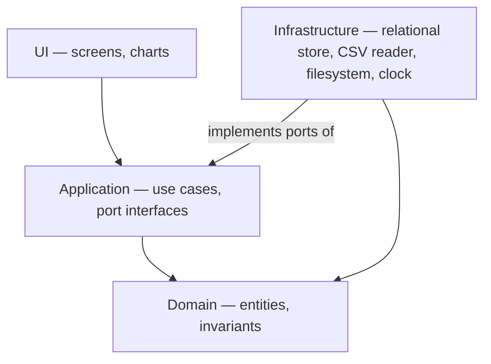
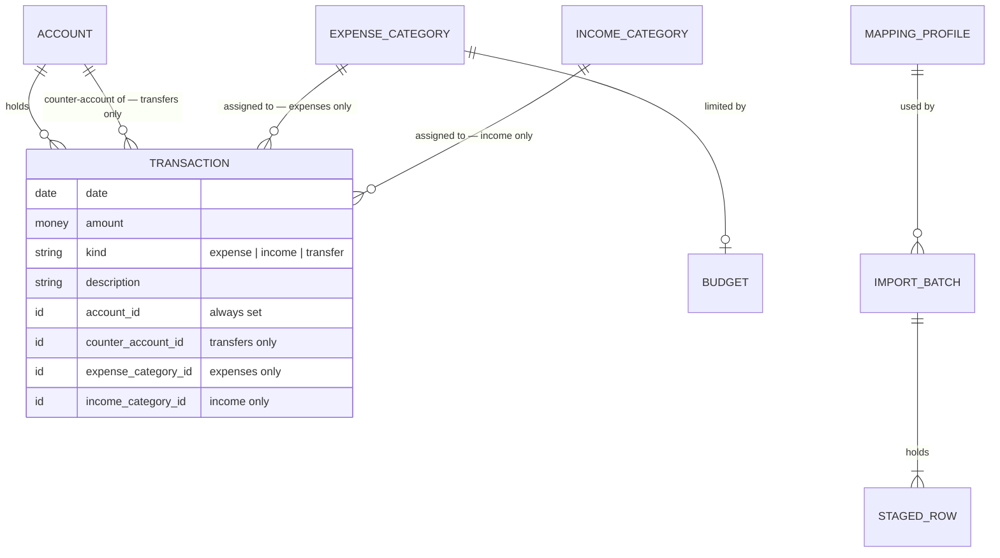
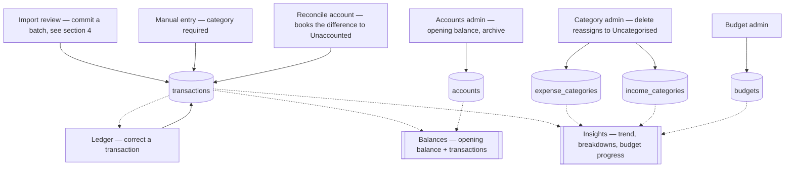
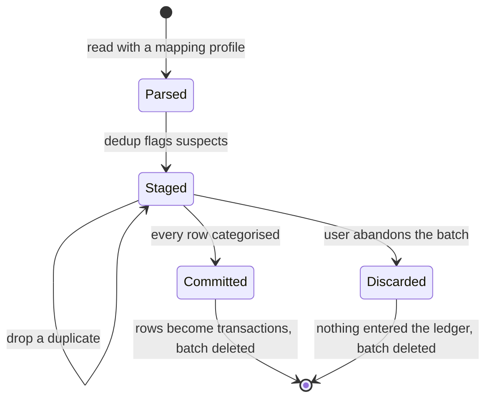

# Architecture

> **Status:** Draft · **Owner:** simon · **Last updated:** 2026-09-09
>
> This document decides *how the product is put together* — layers, domain model, how data gets in,
> and what may never be violated. An **overview**, not a specification.
> Document roles and precedence: [README.md](./README.md).
>
> **Deliberately stack-neutral.** "Relational store" means exactly that; the technology choice and its
> rejected alternatives are made in [techstack.md](./techstack.md).

Each diagram states what its own boxes and arrows mean. No arrow
carries two meanings within one diagram.

---

<a id="layers"></a>
## 1. Layers

**Boxes are layers**, not components or screens. **Arrows mean "depends on"** and point inward only —
the domain layer imports nothing.



Two constraints from [vision.md](./vision.md#principles) land here and nowhere else:

- Anything that might one day become a network call sits behind a **port** — an interface declared in
  Application, implemented in Infrastructure — from day one ([*Local-first*](./vision.md#p-local-first)).
- The data file's location, the HTTP port number, and every filesystem path are **injected at
  startup**: one composition step decides them and hands them to everything else ([*The user can run a local application*](./vision.md#a-local-application)).

<a id="layout"></a>
### Enforcing the boundary

A file's layer **is its folder** — nothing is annotated or configured per file:

```text
src/domain/          imports nothing of ours, and no third-party library
src/application/     may import domain
src/infrastructure/  may import application, domain
src/ui/              may import application, domain
src/<composition root>   may import everything — the single exception, because
                         wiring is the one job that needs the concrete classes
```

**No module may import anything further out than itself.** Enforced by an import check in CI and —
where the language allows it — by making each layer its own compilation unit, so a violation fails to
build rather than merely failing a check. Which tool does this is a
[techstack.md](./techstack.md) decision.

Two symptoms that the boundary has leaked, both cheaper to notice than to lint: a **domain test that
needs a database fixture**, and a **third-party import under `src/domain/`**.

---

<a id="domain-model"></a>
## 2. Domain model

**Boxes are entities.** Arrows mean **relationship**; crow's feet mean cardinality. Only
`TRANSACTION` shows attributes, because that is where every hard decision sits. The rules these
entities must obey are not drawable — they are listed in [§5 Invariants](#invariants).

Labels describe **structure, not action**: there is no actor in this model. The user is the only thing
that ever *does* anything, and is deliberately not an entity — there is exactly one of them
([*Single user, single machine*](./vision.md#a-single-user)).



Three consequences worth naming:

- **Expense and income categories are two tables**, so the rule that they never meet is enforced by
  the schema rather than by careful querying ([features.md](./features.md#categories)). The price:
  `TRANSACTION` carries two nullable category columns, and "exactly one, matching `kind`" becomes a
  check constraint instead of a `NOT NULL`.
- **A transfer is one row with two accounts**, not two offsetting rows, and carries **no** category —
  the reason the charts can be trusted ([features.md](./features.md#transactions)).
- **Budgets attach to expense categories only**, one per category per month.

---

<a id="dataflow"></a>
## 3. Write paths and read models

**Solid arrows = writes. Dotted arrows = reads.** Import is collapsed to one node; §4 expands it.
Shapes, in this diagram only:

| Shape | Meaning |
| --- | --- |
| `[( cylinder )]` | Persisted table |
| `[ rectangle ]` | Screen that writes |
| `[[ doubled sides ]]` | Read-only view |



`transactions` is the only table any read model needs beyond its own reference data. The three
reference tables are **configuration the user maintains**, not steps in a pipeline — which is why
they have their own screens rather than sitting inert in the middle of the flow.

---

<a id="import"></a>
## 4. Import batch lifecycle

The highest-risk feature ([features.md](./features.md#transactions), detail in
[csvImport.md](./csvImport.md)). A batch is the unit that gets committed or discarded — never a
single row. **Boxes are the states of one batch**; arrows mean **transition**.



Review is grouped **by vendor** and unfolds where a vendor spans categories — the difference between
a few dozen decisions and a few hundred, and therefore between hitting and missing the five-minute
target.

---

<a id="invariants"></a>
## 5. Invariants

Violating any of these is a bug, not a trade-off.

1. **Balances are computed** from opening balance plus transactions — never stored as an editable number ([features.md](./features.md#accounts)).
2. **Transfers carry no category**, in this or any version. Every expense and income transaction carries exactly one, from its own side's table.
3. ***Uncategorised* is a real category, never a NULL.** This is what keeps "uncategorised = 0" a meaningful signal.
4. **Nothing in `staged_rows` counts toward any figure.** A row affects a balance or a chart only after its batch is committed.
5. **One write path per transaction kind.** Manual entry goes straight to the ledger; imported rows arrive only via a committed batch. There is no second route, and no optional detour.
6. **Deleting a category never destroys transactions** — they are reassigned to that side's *Uncategorised* ([vision.md](./vision.md#open-questions)).
7. **The domain layer imports nothing** and knows nothing about storage, HTTP, or the filesystem.
8. **Committing or discarding a batch deletes it**, rows included. Staging is scratch space, never
   history — so a transaction holds no link back to the import that created it, and **duplicate
   detection compares incoming rows against committed transactions**, never against staged history.

---

<a id="decisions"></a>
## 6. Decisions recorded here

| Decision | Rationale | Date |
| --- | --- | --- |
| Two category tables rather than one table with a `kind` column | Makes the never-meet rule structurally impossible to break; accepted cost is two nullable FKs on `transactions` and a check constraint | 2026-09-09 |
| This document names no technology | Keeps [techstack.md](./techstack.md) the single place a stack decision is made and justified | 2026-09-09 |
| Import batch, not loose staged rows, is the commit unit | Gives commit, discard, and later undo a single obvious boundary | 2026-09-09 |
| Staged rows are deleted on commit, not retained as provenance | Staging is scratch space; keeping it would add a second, permanent copy of every imported row for a v1 feature nobody asked for. Cost: import undo is not cheap, and would need its own mechanism if ever wanted | 2026-09-09 |
| Layer membership is folder location, checked in CI | No per-file annotation to keep in sync; the rule is one sentence and machine-checkable from day one (see [Enforcing the boundary](#layout)) | 2026-09-09 |
