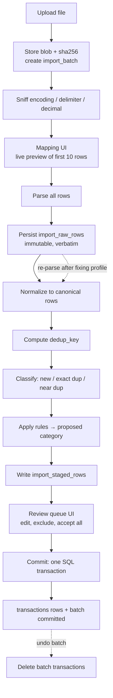

# Financial Copilot — Architecture

**Status:** design, pre-implementation
**Scope:** the no-AI MVP described in `features-verbose.md`
**Date:** 2026-08-14

> **Archived.** This is the *extended* project design, covering the full P0/P1/P2 feature list.
> The active MVP has been reduced to the nine-item subset — see `../ARCHITECTURE.md`.
> Known defects in this document are listed in `README.md` in this folder.

---

## 1. Shape of the system

A single Next.js application, run on `localhost`, storing everything in one SQLite file on your own machine. No cloud service, no container orchestration, no separate API process.

```
┌─────────────────────────────────────────────────────────┐
│ Browser (localhost:3000)                                │
│   React Server Components · client islands for the      │
│   ledger table, import mapper, charts                   │
└────────────────────────┬────────────────────────────────┘
                         │ HTTP (loopback only)
┌────────────────────────┴────────────────────────────────┐
│ Next.js Node process                                    │
│                                                          │
│  app/          route handlers, pages, Server Actions    │
│  services/     use-cases (orchestration + transactions) │
│  domain/       pure TypeScript, zero I/O                │
│  parsers/      CSV + CAMT.053 → canonical rows          │
│  db/           Drizzle schema, migrations, repositories │
└────────────────────────┬────────────────────────────────┘
                         │ better-sqlite3 (in-process, sync)
┌────────────────────────┴────────────────────────────────┐
│ ~/.financial-copilot/app.db   (SQLite, WAL mode)        │
│ ~/.financial-copilot/files/   (uploaded statements,     │
│                                receipt attachments)     │
│ ~/.financial-copilot/backups/ (VACUUM INTO snapshots,   │
│                                synced off-machine — §10)│
└─────────────────────────────────────────────────────────┘
```

Why this shape: the product is a single-user bookkeeping tool whose value is correct arithmetic over your own bank data. Nothing about it needs a network hop, a second runtime, or a hosted database. Removing those removes most of the failure modes in `features-verbose.md` §12 before they exist.

### 1.1 The one non-obvious constraint

The app is built so it can be **promoted to a real server later without redesign**. That means:

- Every table carries `user_id` from the first migration, even though there is exactly one user.
- No query ever reads a table without filtering `user_id`. This filter lives in the repository layer, never in a Server Action or component.
- Nothing in `domain/` or `services/` knows it is talking to SQLite.

When you later want phone access, the change is: swap the Drizzle driver, add Postgres RLS policies as a second line of defence behind the repository filters, deploy. That is a day of work, not a rewrite. If you skip the `user_id` discipline now, it is a month of work.

---

## 2. Layers and the rules between them

Four layers. Dependencies point strictly downward. This is enforced by an ESLint `no-restricted-imports` rule, not by good intentions.

| Layer | Contains | May import | Must not |
|---|---|---|---|
| `app/` | Pages, Server Actions, route handlers | `services/`, `domain/` (types only) | Touch `db/` directly, contain arithmetic |
| `services/` | Use-cases: `commitImportBatch`, `applyRulesRetroactively`, `buildMonthlyReport` | `domain/`, `db/`, `parsers/` | Import from `app/`, know about React or HTTP |
| `domain/` | Money, rule matching, dedup keys, recurring detection, health metrics, report math | Nothing (pure) | Import `db/`, `next`, `fs`, or anything async |
| `db/` | Drizzle schema, migrations, repositories | `domain/` (types only) | Contain business rules |

### 2.1 Why `domain/` being pure matters here

The riskiest parts of this product are all pure functions: whether two rows are the same transaction, which rule wins, whether €1,000 moved to savings counts as an expense, what the savings rate is. Every one of those can be tested in milliseconds with no database, no fixtures, and no server. That is what makes the golden-file report tests in §12 of the feature list actually cheap to write.

Concretely, `buildMonthlyReport` is split in two:

```
services/reports/monthlyReport.ts     ← queries the DB, returns MonthlyFacts
domain/reports/monthlyReport.ts       ← MonthlyFacts → MonthlyReport (pure)
domain/health/statement.ts            ← MonthlyFacts[] → HealthStatement (pure)
```

The golden-file test feeds a committed `MonthlyFacts` JSON fixture into the pure function and asserts the output. It never boots a database, so it cannot rot.

### 2.2 Server Actions are adapters, nothing more

Every Server Action follows the same four lines:

```ts
'use server';
export async function categorizeTransaction(input: unknown) {
  const dto = CategorizeInput.parse(input);        // 1. zod validation at the boundary
  const userId = await requireUserId();            // 2. session → user_id
  await txService.categorize(userId, dto);         // 3. delegate to a use-case
  revalidatePath('/ledger');                       // 4. invalidate
}
```

If a Server Action grows a fifth concern, the logic belongs in `services/`. This is the single discipline that keeps a full-stack Next.js app from becoming untestable.

---

## 3. Money

`domain/money.ts` is written first, before any schema. It is the foundation everything else stands on.

```ts
type Money = { readonly minor: number; readonly currency: string };
```

Rules:

- **Integer minor units only.** €1,234.56 is `{ minor: 123456, currency: 'EUR' }`. Never a float, never a decimal string in arithmetic.
- `number` is safe here: `Number.MAX_SAFE_INTEGER` is 9,007,199,254,740,991 minor units — about 9 quadrillion euro-**cents**, i.e. ~90 trillion **euros**. Every constructor asserts `Number.isSafeInteger`. `bigint` was rejected because `JSON.stringify` throws on it (so it fouls the export, the audit log, and every JSON column), and because it round-trips awkwardly through Drizzle and SQLite for no benefit at this scale.
- **Signed amounts, one convention:** expenses are negative, income positive. Enforced in the domain layer, asserted at every DB write. The UI displays absolute values with direction shown separately — the sign never appears in a form field.
- `add`/`subtract` throw on currency mismatch. There is no implicit conversion anywhere.
- `allocate(total, weights)` uses **largest-remainder** distribution so split transactions sum exactly to the parent. `allocate(€10, [1,1,1])` returns `[3.34, 3.33, 3.33]`, never `[3.33, 3.33, 3.33]`.
- Formatting lives in `domain/format.ts` via `Intl.NumberFormat`, is called only in the presentation layer, and is never parsed back.

Storage: SQLite `INTEGER` for `amount_minor`, `TEXT` for `currency`. SQLite has no decimal type, which is a feature — it removes the temptation to use one.

### 3.1 Foreign currency

An FX transaction stores four things on the row and never recomputes them: `original_amount_minor`, `original_currency`, `fx_rate` (as `TEXT`, an exact decimal string), and `amount_minor` in base currency. Rates are historical facts, not derivable values. `fx_rates` exists as a manual convenience table for filling in a rate you don't have, not as a source of truth.

### 3.2 Two amounts per row, and why

Every transaction stores **two** signed integers:

| Column | Currency | Used for |
|---|---|---|
| `amount_minor` | base currency (from `settings`) | every report, every aggregate, every health metric |
| `account_amount_minor` | the **account's** currency | that account's balance, and only that |

For a EUR account in a EUR-base setup these are always equal, and the second column looks redundant. It is not. Without it, `accounts.opening_balance_minor + SUM(amount_minor)` adds an account-currency opening balance to base-currency movements the moment you own one non-EUR account — a silently wrong balance that `Money.add` would have thrown on in the domain layer but that raw SQL will happily compute.

Reports read `amount_minor` only. Balances read `account_amount_minor` only. Neither ever reads the other.

---

## 4. Data model

Three conventions that apply to every table below and are not repeated in each sketch:

1. **Naming.** Auth.js v5 wants a table called `accounts` for OAuth provider links. Ours is a bank account. Auth.js tables are prefixed `auth_` via the adapter's table config. Getting this wrong on day one is a painful migration later. `auth_users` is the referent of every `user_id`.
2. **`user_id` is on every table.** Including child tables (`transaction_splits`, `transaction_tags`, `recurring_members`, `import_raw_rows`, `import_staged_rows`) where it is technically derivable through a parent. Derivable is not good enough: Postgres RLS policies need a local `user_id` column on every table they protect, and adding it later to eight child tables is exactly the retrofit §1.1 exists to avoid. Every `user_id` is `NOT NULL REFERENCES auth_users(id)`.
3. **Every reference is a declared foreign key**, with an explicit `ON DELETE` action. `PRAGMA foreign_keys = ON` protects nothing if there are no constraints to enforce. Deletes are `RESTRICT` by default — the app decides what may be deleted — except for genuinely owned children (`transaction_splits`, `transaction_tags`, `recurring_members`, `import_staged_rows`, `attachments`), which `CASCADE`.

Migration ordering note: `transactions` references `import_batches` and `import_raw_rows`, so migration 0001 creates the import tables even though the import feature is built at step 9. Creating a table earlier than its UI is free; adding an FK to a populated table on SQLite is a full rebuild.

### 4.1 Core ledger

```sql
accounts
  id, user_id, name,
  type          TEXT CHECK (type IN ('checking','savings','credit_card','cash','loan')),
  currency, opening_balance_minor, opening_date,   -- opening balance in ACCOUNT currency
  is_liquid     INTEGER NOT NULL DEFAULT 0,   -- feeds emergency-fund runway
  archived_at, icon, color, iban_last4,
  created_at, updated_at
  UNIQUE (user_id, name)

categories
  id, user_id, name,
  parent_id     REFERENCES categories(id) ON DELETE RESTRICT,
  kind          TEXT NOT NULL CHECK (kind IN ('income','expense','transfer')),
  is_fixed      INTEGER NOT NULL DEFAULT 0,   -- fixed-vs-variable metric
  is_essential  INTEGER NOT NULL DEFAULT 0,   -- emergency-fund runway denominator
  exclude_from_reports INTEGER NOT NULL DEFAULT 0,
  sort_order, color, icon,
  UNIQUE (user_id, COALESCE(parent_id, ''), name)   -- expression index; see note 1
  CHECK (parent_id IS NULL OR (SELECT parent_id FROM ...) IS NULL)  -- two levels,
                                              -- enforced in the app layer, not SQL

transactions
  id, user_id,
  account_id    NOT NULL REFERENCES accounts(id) ON DELETE RESTRICT,
  category_id   REFERENCES categories(id) ON DELETE RESTRICT,
  booking_date  TEXT NOT NULL,               -- 'YYYY-MM-DD', no timezone, ever
  value_date    TEXT,
  amount_minor  INTEGER NOT NULL,            -- signed, BASE currency  → reports
  account_amount_minor INTEGER NOT NULL,     -- signed, ACCOUNT currency → balances
  currency      TEXT NOT NULL,               -- base currency of amount_minor
  counterparty_raw   TEXT,                   -- exactly as the bank wrote it
  counterparty  TEXT,                        -- normalized, displayed
  description, notes,
  transfer_group_id  TEXT,                   -- both legs share this
  is_excluded   INTEGER,                     -- NULL = inherit category; 0/1 = override
  has_splits    INTEGER NOT NULL DEFAULT 0,  -- see note 2
  status        TEXT NOT NULL DEFAULT 'booked'
                CHECK (status IN ('booked','pending')),
  original_amount_minor, original_currency, fx_rate,
  import_batch_id REFERENCES import_batches(id) ON DELETE SET NULL,
  raw_row_id      REFERENCES import_raw_rows(id) ON DELETE SET NULL,
  dedup_key     TEXT NOT NULL,
  created_at, updated_at,
  edited_at     TEXT,                        -- NULL until a user edit; see §5.4

  UNIQUE (user_id, account_id, dedup_key)    -- the dedup guarantee, in the schema
  INDEX (user_id, booking_date)                        -- ledger default sort
  INDEX (user_id, account_id, booking_date)            -- account detail
  INDEX (user_id, category_id, booking_date)           -- category drill-down
  INDEX (user_id, transfer_group_id)                   -- transfer legs
  INDEX (user_id, account_id, amount_minor, booking_date) -- near-dup detection
  INDEX (user_id, amount_minor, booking_date)           -- transfer pairing suggestions
  INDEX (user_id, account_id, account_amount_minor)     -- covering: balance SUM
  INDEX (import_batch_id)                              -- undo / re-parse a batch
  INDEX (user_id, counterparty)                        -- autocomplete, top-counterparties

transactions_fts                              -- FTS5 virtual table, external content
  -- content='transactions', columns: counterparty, description, notes
  -- kept in sync by AFTER INSERT/UPDATE/DELETE triggers
  -- powers P0 full-text search; LIKE '%x%' cannot use an index and will not scale

transaction_splits
  id, user_id,
  transaction_id NOT NULL REFERENCES transactions(id) ON DELETE CASCADE,
  category_id    NOT NULL REFERENCES categories(id) ON DELETE RESTRICT,
  amount_minor  INTEGER NOT NULL,            -- signed, base currency, same sign as parent
  note
  INDEX (transaction_id)
  -- invariant: SUM(amount_minor) = parent.amount_minor, asserted in the domain AND
  --   in the same SQL transaction that writes them. parent.has_splits set atomically.

tags                (id, user_id, name, UNIQUE (user_id, name))
transaction_tags    (user_id, transaction_id, tag_id) PK (transaction_id, tag_id),
                     both FKs ON DELETE CASCADE
counterparty_aliases(id, user_id, pattern, match_type, canonical_name, priority)
recurring_series    (id, user_id, name, counterparty, cadence, typical_amount_minor,
                     source TEXT CHECK (source IN ('detected','manual')),
                     status TEXT CHECK (status IN ('detected','confirmed','dismissed')),
                     last_seen, next_expected, detected_at, confirmed_at)
recurring_members   (user_id, series_id, transaction_id)  -- series is auditable
fx_rates            (id, user_id, date, base, quote, rate TEXT,
                     UNIQUE (user_id, date, base, quote))
audit_log           (id, user_id, at, entity, entity_id, action, before JSON, after JSON,
                     INDEX (user_id, entity, entity_id))
attachments         (id, user_id, transaction_id, filename, mime, byte_size,
                     sha256, stored_path)
settings            (user_id PK REFERENCES auth_users(id), base_currency, locale,
                     date_format, timezone, theme, onboarded_at)
```

**Note 1 — the `COALESCE` in the category unique index is not cosmetic.** SQL treats NULLs as distinct in unique indexes, so a plain `UNIQUE (user_id, parent_id, name)` lets you create three top-level categories called "Wohnen". That is precisely the duplicate-category mess that "merge two categories" exists to clean up, and it is free to prevent.

**Note 2 — `has_splits` exists so reports cannot silently ignore splits.** See §7.1.

**Note 3 — `month_start_day` is deliberately absent from `settings`.** The feature list includes it, and it is incompatible with the `MonthlyFacts` seam in §7.2, which keys everything on calendar months (`'2026-08'`). Supporting a configurable month start means every aggregate, every "vs last month" delta, and every 6-month average takes an offset parameter, and `'2026-08'` stops being a meaningful key. That is a large amount of complexity and test surface for a preference most people set once to the 1st. Deferred with the reason recorded; if you genuinely need a salary-aligned month, it becomes a period-boundary abstraction in the domain layer rather than a column.

### 4.2 Import tables

```sql
import_batches
  id, user_id, account_id, mapping_profile_id,
  source_filename, source_sha256, stored_path,
  format        TEXT,          -- 'csv' | 'camt053'
  detected_encoding, detected_delimiter, detected_decimal,
  status        TEXT,          -- 'uploaded'|'parsed'|'reviewing'|'committed'|'reverted'
  row_counts    JSON,          -- {parsed, staged, duplicate, committed, skipped}
  created_at, committed_at, reverted_at

import_raw_rows                -- immutable, never updated
  id, user_id,
  batch_id NOT NULL REFERENCES import_batches(id) ON DELETE CASCADE,
  row_index,
  raw JSON NOT NULL,           -- CSV: the cells; CAMT: the <Ntry> subtree as JSON
  UNIQUE (batch_id, row_index)

import_staged_rows             -- mutable scratch space, deleted after commit
  id, user_id,
  batch_id NOT NULL REFERENCES import_batches(id) ON DELETE CASCADE,
  raw_row_id NOT NULL REFERENCES import_raw_rows(id) ON DELETE CASCADE,
  near_duplicate_of REFERENCES transactions(id) ON DELETE SET NULL,
  parse_status, parse_error,
  booking_date, value_date, amount_minor, account_amount_minor, currency,
  counterparty_raw, counterparty, description,
  dedup_key,
  dedup_state   TEXT,          -- 'new' | 'exact_duplicate' | 'near_duplicate'
  proposed_category_id, proposed_tags JSON, matched_rule_id,
  user_category_id, user_excluded, user_decision  -- 'accept'|'skip'|undecided

mapping_profiles
  id, user_id, name, account_id, format,
  config JSON NOT NULL,        -- column map, date format, sign convention, decimal sep
  created_at, updated_at, last_used_at
```

### 4.3 Rules

```sql
rules
  id, user_id, name, priority INTEGER NOT NULL, enabled,
  conditions JSON NOT NULL,    -- see below
  actions    JSON NOT NULL,
  hit_count INTEGER DEFAULT 0, last_matched_at,
  INDEX (user_id, priority)    -- NOT unique; see note
```

**Note on `priority`:** deliberately **not** a unique constraint. SQLite enforces uniqueness row-by-row during a multi-row `UPDATE` and has no deferrable constraints, so the obvious reorder — `UPDATE rules SET priority = priority + 1 WHERE priority >= ?` — fails mid-statement depending on row visit order. Priority is a sparse integer (new rules get `MAX + 100`), reordering rewrites the affected range inside one transaction, and ties break deterministically by `id` so "first match wins" stays reproducible even if two rules share a number.

`conditions` and `actions` are JSON validated by zod on read and write, rather than normalized into `rule_conditions` rows. Reason: rules are always loaded and evaluated as a whole set in application code, never queried by condition. Normalizing them would buy query power nobody needs and cost a three-table join on the hottest path in the import pipeline. The zod schema is versioned so a future condition type is a migration of JSON shape, not of tables.

```ts
type Condition =
  | { field: 'counterparty' | 'description'; op: 'contains' | 'startsWith' | 'regex'; value: string }
  | { field: 'amount'; op: 'between'; min: number; max: number }
  | { field: 'direction'; op: 'is'; value: 'in' | 'out' }
  | { field: 'account'; op: 'is'; value: string };

type Action =
  | { type: 'setCategory'; categoryId: string }
  | { type: 'addTags'; tagIds: string[] }
  | { type: 'renameCounterparty'; to: string }
  | { type: 'markTransfer' }
  | { type: 'markExcluded' };
```

### 4.4 Three deliberate model decisions

**Balances are never stored.** `accounts.opening_balance_minor + SUM(transactions.account_amount_minor)` is the balance, computed on read. A stored mutable balance is the classic bookkeeping bug: it drifts, and once it drifts you cannot tell which number is wrong. At single-user data volumes (~10k rows/year) this is sub-millisecond over the covering index `(user_id, account_id, account_amount_minor)`.

**Transfers are two rows, not one.** A €1,000 move from checking to savings is `-100000` on checking and `+100000` on savings, sharing a `transfer_group_id`. This is the only model that keeps both account balances correct without special-casing. Every report excludes rows where `transfer_group_id IS NOT NULL`. The import path necessarily produces the two legs separately (they arrive in different statements), which is why "pair two existing transactions as a transfer" is a P0 feature and not a nicety.

**A transfer group has a validated invariant, and violations are surfaced.** Because §7.1 excludes *every* row carrying a `transfer_group_id` from both income and expenses, a malformed group silently erases a real transaction from every report — no error, no warning, exactly the R1 failure mode. So the group is invariant-checked:

```
exactly 2 legs · opposite signs · SUM(amount_minor) = 0 · different accounts
```

Enforced in the domain when pairing or creating, and additionally checked by a standing query (`SELECT transfer_group_id ... GROUP BY ... HAVING COUNT(*) != 2 OR SUM(amount_minor) != 0`) whose result feeds the data-quality banner. An invariant nobody checks after the fact is a convention.

The `SUM = 0` rule is stated in base currency, which is what makes a cross-currency transfer (EUR checking → CHF savings) fail the check. That is correct behaviour, not a bug: such a transfer has an FX spread and the two legs genuinely do not cancel. It is flagged for review rather than being silently accepted or silently rejected.

---

## 5. The import pipeline

The heart of the product, and the only part with genuinely hard edges. It is a staged pipeline where every stage is resumable and nothing before "commit" touches the `transactions` table.



### 5.1 Sniffing

German bank exports are the adversary here: `;` delimiters, `ISO-8859-1` or `windows-1252` encoding, `1.234,56` decimals, `DD.MM.YYYY` dates, and sometimes separate `Soll`/`Haben` columns with unsigned values. Detection is heuristic and **always overridable in the UI** — an undetectable file must never be a dead end. Detection order: BOM → `chardet` byte analysis → delimiter frequency in the first 20 lines → decimal separator by regex vote across the amount column.

### 5.2 Immutable raw rows

Every source row is persisted verbatim as JSON before any interpretation. This is the single most valuable design decision in the import path. Six months in you will discover that one bank puts the counterparty in a different field for SEPA direct debits — and you will fix the parser and re-run it over two years of stored rows, instead of hunting for the original files.

CAMT.053 gets first-class treatment for the same reason: each `<Ntry>` subtree is stored as JSON, and it carries structured fields (end-to-end ID, mandate reference, creditor name, purpose code) that CSV throws away. CSV ships first because every bank has it; CAMT is what you will actually want.

### 5.3 Dedup

```
if (isUsableReference(bankEndToEndId))
    dedup_key = 'eref:' + bankEndToEndId
else
    dedup_key = 'h:' + sha256([
        account_id,
        booking_date,                       // YYYY-MM-DD
        amount_minor,                       // signed integer
        normalizeDescription(description),  // lowercase, collapse whitespace,
                                            //   strip punctuation, strip trailing digits
        ordinalWithinSource                 // 0,1,2… for otherwise-identical rows
      ].join(' '))
```

Three details, each of which is a data-loss bug if you get it wrong.

**`isUsableReference` must reject sentinel values.** German SEPA and CAMT feeds routinely emit `EndToEndId` as `NOTPROVIDED`, `NOTAVAILABLE`, an empty string, or one constant repeated across every collection under a single mandate. Trusting those blindly means every entry after the first collides on the unique index and is discarded by `ON CONFLICT DO NOTHING` — no error, no counter, no trace. That is R5's "too strict" failure, the one that leaves your ledger quietly incomplete. A sentinel blacklist plus a minimum-entropy check gates the fast path; anything rejected falls through to the hash.

**`ordinalWithinSource` is computed from the source file alone, never from the database.** This is the subtle one. If the ordinal counted matching rows *already in the database*, then re-importing a statement containing two identical €4.50 coffees would find two existing matches, assign ordinals 2 and 3 instead of 0 and 1, produce two brand-new dedup keys, and commit two duplicates. The idempotency acceptance test would fail — and it would fail **only** on files containing genuine same-day repeats, which is precisely the case nobody thinks to test by hand.

So the ordinal is the row's rank among rows sharing the same `(booking_date, amount_minor, normalizedDescription)` **within the file being parsed**, in file order. The whole key is then a pure function of the file's bytes: parse the same file a hundred times and every key is identical. Two real coffees still survive, because within the source they are rank 0 and rank 1.

The residual case this rule accepts: if a bank splits one day's entries across two files, both coffees are rank 0 in their respective files and the second is wrongly dropped. That is what near-duplicate flagging catches, and it is why near-duplicate flagging is P0 rather than a nicety.

**Manual transactions use `dedup_key = 'manual:' + uuid`.** The column is `NOT NULL` and uniquely indexed, so quick-add needs a defined rule. Hashing manual entries instead would make two identical €4.50 cash entries typed on the same day collide, and the app would silently swallow the second one — on the P0 quick-add path.

Enforcement is the `UNIQUE (user_id, account_id, dedup_key)` index, not application logic. The commit inserts with `ON CONFLICT DO NOTHING` and counts affected rows. Application-level dedup checks are a best-effort optimization for showing the user what will happen; the index is the guarantee. The acceptance test — import the same statement twice, second import commits zero rows — passes because of the index *and* because the key depends only on the source file.

**Near-duplicates** (same amount + counterparty within 3 days, different dedup key) are flagged for human judgment and never auto-dropped. Silently deleting a real transaction is a much worse failure than showing you one extra row to confirm.

### 5.4 Commit

**One SQLite transaction, no chunking, no exceptions.** Insert transactions, bump rule hit counters, update batch status, delete staged rows, write audit entries. If anything throws, the whole batch rolls back and the user retries from the review queue with nothing lost.

Chunking was considered and rejected. A partially-committed batch breaks two things that matter more than commit latency: undo-batch can no longer assume it is deleting a complete unit, and the idempotency guarantee becomes "zero new rows unless the first import half-failed." better-sqlite3 inserts ~50k prepared-statement rows per second in a single transaction, so even an implausible 100k-row batch commits in about two seconds — and a two-second freeze on an operation the user explicitly clicked is not a problem worth trading atomicity for.

**Undo a batch** deletes `transactions WHERE import_batch_id = ?`, but only rows where `edited_at IS NULL`. A row you have since edited is surfaced for confirmation rather than silently destroyed. `edited_at` is set explicitly by the update path, and only by user-initiated edits — comparing `updated_at = created_at` instead would be a coin flip, since two independently generated timestamps or a Drizzle `$onUpdate` firing on insert would make untouched rows look edited.

---

## 6. Rules engine

```ts
// domain/rules/apply.ts — pure, no I/O
function applyRules(rules: Rule[], tx: CanonicalRow): RuleOutcome | null
```

- Rules are sorted by `priority` ascending; **first match wins**; evaluation stops there. No merging of actions from multiple rules, no hidden precedence.
- Conditions within a rule combine with **AND** only. No OR, no nesting. If you need OR, write two rules — which is more readable and trivially explains itself in the UI.
- `regex` conditions run under a length cap and a timeout guard. A catastrophically backtracking pattern typed into a text field should not hang your import.

Because `applyRules` is pure and takes the rule set as an argument, three features are the same function called differently:

| Feature | Call |
|---|---|
| Rules applied during import | `applyRules(rules, stagedRow)` per row, before writing staged rows |
| Rule dry-run ("matches 47 transactions") | `applyRules([candidateRule], tx)` over a query result, nothing written |
| Apply retroactively | `applyRules(rules, tx)` over a filtered set, inside one SQL transaction |

**"Create rule from this transaction"** is a pure derivation too: `suggestRule(tx) → Rule` picks the longest stable token from the counterparty as a `contains` condition, prefills the transaction's current category, and assigns the next free priority. The user always sees and edits the result before saving.

Counterparty normalization runs **before** rule matching, so a rule can be written against `Spotify` rather than `PAYPAL *SPOTIFYAB 3531…`. It is the same pattern-matching primitive as rules, applied to one field.

---

## 7. Reporting and health metrics

All reports are **derived on read**. No materialized monthly summaries, no aggregate tables, no cache invalidation problem. At this data scale, a monthly report is one indexed query.

### 7.1 The exclusion predicate

Every income/expense aggregate in the entire application goes through one shared SQL fragment. This is defined once, in `db/queries/reportable.ts`, and imported everywhere:

```sql
WHERE t.user_id = ?
  AND t.transfer_group_id IS NULL      -- both legs of internal moves gone
  AND t.is_excluded = 0                -- row-level override
  AND (c.exclude_from_reports = 0 OR c.id IS NULL)
  AND (c.kind != 'transfer' OR c.id IS NULL)
```

Duplicating this predicate is how a report ends up silently 15% wrong. There is a test asserting that every aggregate query in the codebase references the shared fragment.

The acceptance test from the feature list — transfer €1,000 to savings, income and expenses both unchanged — is a golden-file test over this predicate.

### 7.2 MonthlyFacts as the seam

```ts
type MonthlyFacts = {
  month: string;                          // '2026-08'
  incomeMinor: number;
  expenseMinor: number;
  byCategory: { categoryId: string; parentId: string | null;
                isFixed: boolean; amountMinor: number }[];
  liquidBalanceMinor: number;
  recurringMonthlyOutflowMinor: number;
  uncategorized: { count: number; amountMinor: number };
};
```

One query produces `MonthlyFacts`. Pure functions turn it into everything else: the KPI row, the category breakdown with vs-last-month and vs-6-month-average deltas, savings rate, fixed/variable split, runway, commitment load, concentration, deviation flags, and the "needs attention" list. Twelve months of `MonthlyFacts` produce the trend charts and the rolling averages.

This seam is what makes the health statement testable. Every metric is `(facts) => value` with a committed fixture, so a regression in the savings-rate formula fails a unit test in 3ms rather than misinforming you for a month.

### 7.3 The data-quality banner is part of the report, not decoration

`MonthlyFacts.uncategorized` is computed by the same query as the totals, and the banner renders from it unconditionally. A report that cannot tell you how much of itself is unclassified is worse than no report, because you will trust it.

### 7.4 Recurring detection

Pure statistics in `domain/recurring/detect.ts`:

1. Group outflows by normalized counterparty.
2. Require ≥3 occurrences.
3. Amounts within ±10% of the group median.
4. Interval gaps cluster around 7 / 30 / 91 / 365 days within a tolerance window (±4 days monthly, ±10 quarterly).
5. Emit a candidate series with cadence, typical amount, last seen, next expected.

Detection is advisory. A series stays `detected` until the user confirms or dismisses it, and only `confirmed` series count toward "total monthly commitment" and the commitment-load metric. Price-change detection compares consecutive member amounts within a confirmed series — a pure diff, no model.

Detection runs on demand (a button on the Recurring page) and after each import commit, not on a schedule. There is no background job runner in this architecture, and adding one for a single-user local app would be unjustified complexity.

---

## 8. Auth and the local security model

Auth.js v5 with a **Credentials provider** over an argon2id-hashed passphrase, JWT session in an httpOnly cookie, Drizzle adapter against the `auth_*` tables.

Note the deviation: the feature list specifies magic link or passkey. Magic link on `localhost` requires an SMTP configuration to email yourself, which is friction with no security benefit when the attacker would already need filesystem access to your machine. The Auth.js provider abstraction means switching to `Email` or `Passkey` later is a config change plus a migration, so nothing is foreclosed.

What auth is actually for here:

1. A real `user_id` in a real session, so the tenancy discipline in §1.1 is exercised from day one rather than retrofitted.
2. A lock screen if you walk away from your desk.

What it is explicitly **not** for: the server binds to `127.0.0.1` only and is not exposed to the network. The database file is unencrypted — full-disk encryption (FileVault / LUKS / BitLocker) is the right layer for that, and this is stated in the README so the assumption is never accidental.

`requireUserId()` is the single chokepoint. Every Server Action and route handler calls it first. A repository method that receives no `userId` argument is a type error, not a runtime bug.

---

## 9. Frontend structure

Server Components by default. Client components only where interaction demands it, and each one is named so the boundary is obvious.

| Screen | Rendering |
|---|---|
| Dashboard, monthly overview, health statement | Server Components; charts hydrate as small client islands |
| Ledger table | Client component. Filters live in the URL search params; the server re-queries on change. TanStack Table + TanStack Virtual for 10k+ rows |
| Import mapper | Client component with local state; live preview calls a Server Action that parses 10 rows and returns them un-persisted |
| Uncategorized inbox | Client component; keyboard-driven, optimistic updates via `useOptimistic` |
| Quick-add | Client component, responsive down to phone width; the only mobile-first screen |

Two deliberate choices:

**Filters in the URL.** The ledger's entire filter state serializes to search params. This makes every view shareable, bookmarkable, back-button-correct, and makes "saved views" (P2) a matter of storing a query string. It also means the expensive query runs on the server against indexes rather than filtering 10k rows in the browser.

**Charts.** Recharts, ~6 chart types total. Kept in leaf client components so no chart library ever appears in the server bundle.

---

## 10. Backups

The one operational concern that cannot be waved away: this file is your financial history and it lives on one disk.

- SQLite in **WAL mode**. Nightly (and pre-migration) `VACUUM INTO ~/.financial-copilot/backups/app-YYYY-MM-DD.db` — a consistent snapshot that does not require stopping the app.
- Keep 7 daily, 4 weekly, 12 monthly. Rotation is ~20 lines of script.
- The backups directory sits inside a folder you already sync (iCloud / Dropbox / Syncthing) or a `restic` job to cheap object storage. Off-machine is the point; a backup on the same disk protects against your mistakes, not the disk's.
- **A restore test is a task in the first week, not a good intention.** `scripts/verify-backup.ts` restores the newest backup to a temp path, opens it, runs `PRAGMA integrity_check`, and asserts the transaction count matches the live DB. It runs as part of the nightly script and fails loudly.

---

## 11. Testing strategy

Mapped directly onto the risk in each area rather than chasing coverage.

| Area | Approach |
|---|---|
| `domain/money.ts` | Unit tests written **before** the implementation. Rounding, allocation summing exactly, currency-mismatch throws, safe-integer bounds |
| Dedup keys | Unit tests per input variation + the idempotency test: same file twice, second import inserts zero rows |
| Rules | Unit tests for each condition type, priority ordering, first-match-wins, regex timeout guard |
| Recurring detection | Fixture series (clean monthly, drifting dates, price change, only 2 occurrences) with asserted output |
| Reports and health metrics | **Golden-file tests.** Committed `MonthlyFacts` fixtures → asserted JSON output. Any change to an aggregate shows up as a reviewable diff |
| Exclusion correctness | Integration test on a real SQLite temp DB: seed a ledger, create a transfer, assert income and expenses unchanged |
| Repositories | Integration tests against `:memory:` SQLite — fast enough to run on every save |
| Import flow end-to-end | One Playwright test: upload → sniff → map → preview → review → commit → verify ledger |

Vitest for everything except the Playwright test. `better-sqlite3` with `:memory:` makes integration tests as fast as unit tests, which is a real advantage of the SQLite choice.

---

## 12. Build order

Dependency-ordered, so nothing is built on a foundation that later moves.

1. `domain/money.ts` + its tests. Nothing else. It is ~100 lines and it prevents the class of bug that destroys trust in the whole product.
2. Migration 0001: `auth_*`, `settings`, `accounts`, `categories`, `transactions`. Seed the German category taxonomy with `is_fixed` set correctly while seeding.
3. Auth.js + `requireUserId()` + the repository tenancy pattern. Establish the discipline before there are 40 queries to retrofit.
4. Accounts CRUD + computed balances. First screen where the money type earns its keep.
5. Transaction CRUD + quick-add. Now the app is usable, badly.
6. Ledger: table, filters in URL, filter summary bar, inline category edit. This is where you will live.
7. Transfers: the two-leg form, then pairing two existing rows.
8. Rules engine (`domain/rules/`) with tests, then the rules CRUD UI, then "create rule from this transaction".
9. Import: CSV only. Sniffing → mapping profile → live preview → raw rows → dedup → staged rows → review → commit. Largest single chunk of work in the MVP; do not start it before steps 1–8 are solid.
10. Monthly overview: `MonthlyFacts` query, the shared exclusion predicate, pure report functions, golden-file tests, the data-quality banner.
11. Health statement: the four P0 metrics off the same `MonthlyFacts`.
12. Export + backups + verified restore.
13. **Use it on your own real statements for a month.** Then reorder everything below.
14. CAMT.053, recurring detection, splits, tags, bulk edit, undo/re-parse batch, keyboard navigation.

Steps 1–3 are load-bearing for everything after them. Step 13 is not optional; it is how you find out which P1s are actually P0s.

---

## 13. Architecture decision records

| # | Decision | Alternatives rejected | Why |
|---|---|---|---|
| 1 | Local web app on `localhost`, no desktop shell | Electron + bundled Next server; Tauri + static export + Rust; managed cloud | Keeps App Router, Server Actions and Auth.js intact with zero shell complexity. Tauri would have forced the domain layer into Rust — a second language for the exact code that most needs to be well-tested. Promotable to a VPS later for phone access |
| 2 | SQLite via better-sqlite3 | Postgres in Docker; PGlite | One file, no daemon, synchronous in-process driver, `:memory:` tests. Single-writer is irrelevant for one user. Cost: no RLS, mitigated by §1.1 |
| 3 | Drizzle ORM | Prisma; Kysely; raw SQL | SQL-shaped API keeps the report aggregates readable; plain `.sql` migration files you can review; same schema syntax across SQLite and Postgres, which is what makes ADR 1's promotion path cheap. Prisma's aggregation story pushes you to raw SQL anyway |
| 4 | Integer minor units in a `Money` type | `decimal.js`; float; decimal strings | No floating-point class of bug at all. `Intl` handles display. Explicit `allocate` for splits |
| 5 | Balances computed, never stored | Stored balance with triggers | A drifting stored balance is unfalsifiable. Recomputation is sub-millisecond at this scale |
| 6 | Reports derived on read | Materialized monthly aggregates | No cache invalidation problem, no staleness class of bug. Revisit only if a report exceeds ~200ms |
| 7 | Rule conditions as validated JSON | Normalized condition tables | Rules are always evaluated as a whole set, never queried by condition. Normalization adds joins on the hottest import path for query power nobody needs |
| 8 | `user_id` on every table from migration 0001 | Add it when multi-user arrives | Retrofitting tenancy across 20 tables and 60 queries is a month. Adding a column now is free |
| 9 | Credentials auth, not magic link | Magic link via SMTP; passkey | SMTP on localhost is friction with no threat-model benefit. Auth.js abstraction keeps both open |
| 10 | No background job runner | node-cron; BullMQ | Recurring detection runs on demand and after import. A single-user local app with no scheduled work does not need a scheduler |

---

## 14. What this architecture deliberately does not support

Stated so that a future decision to add one of these is recognized as an architectural change rather than a feature:

- **Multi-user or household sharing.** The tenancy columns exist; the auth, invitation, and permission model do not.
- **Concurrent writers.** SQLite's single writer is fine for one person and one browser tab. Two people importing simultaneously is not a supported scenario.
- **Phone access.** Requires ADR 1's promotion path: deploy to a VPS, swap the driver, add RLS.
- **Bank sync (PSD2).** Would add a scheduled job runner, OAuth token storage, and a webhook receiver — all absent by design.
- **AI features.** The rules engine and the review queue are the seams where they would attach: a model would propose a category for rows the rules missed, writing into `import_staged_rows.proposed_category_id` exactly as a rule does. Nothing in this design needs to change to accommodate that, which is the point of building the deterministic version first.
